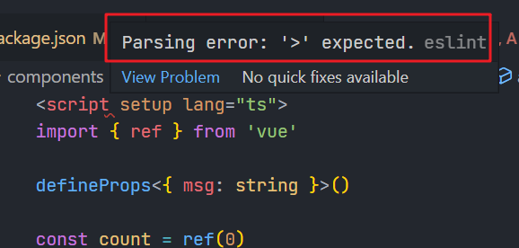
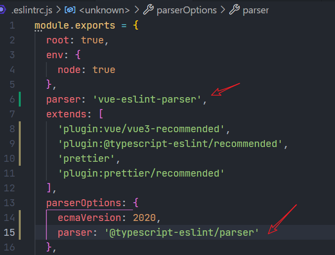
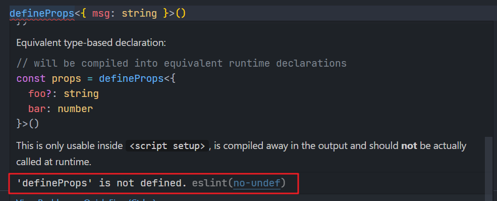
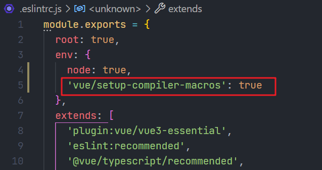
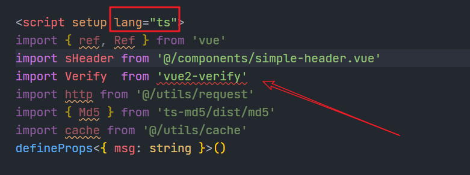
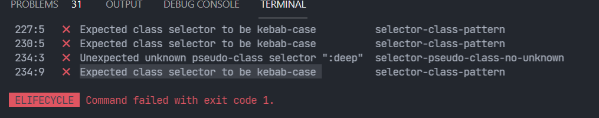
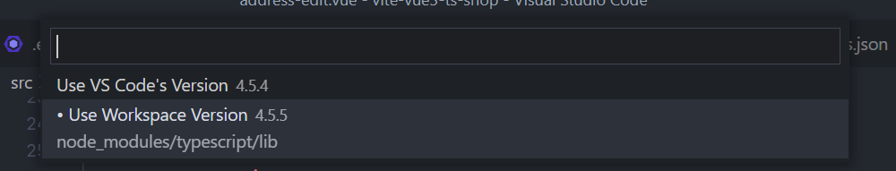

# 项目

`pnpm create vite`，然后选 `vue`，再选 `vue-ts`。

## 报错

1.setup 报错：


在 .eslintrc.js 文件中补充以下代码：


添加相关 rules 防报错。

2.defineProps' is not defined.eslint(no-undef)。


解决，写入下方代码并重启。


说明：<https://eslint.vuejs.org/user-guide/>。

3.`Cannot find module 'vue2-verify' or its corresponding type declarations.ts(2307)`



将 `lang='ts'` 去掉，在 tsconfig.json 中加入 `"allowJs": true`。

## 配置

3.vite 别名配置

tsconfig.json:

```json
"compilerOptions": {
  "baseUrl": ".",
  "paths": {
    "@/*": ["src/*"],
    "@components/*": ["src/components/*"]
  }
},
```

vite.config.ts:

```ts
export default defineConfig({
  plugins: [vue()],
  resolve: {
    alias: {
      '@': path.resolve(__dirname, 'src'),
      components: path.resolve(__dirname, 'src/components')
    }
  }
})
```

`husky+stylelint+prettier+eslint+vite~alias~proxy+vue3~router~pinia+ts+commitlint+lint-staged`

4.github main 分支上提交的第一版为 vue3 vite pinia 环境配置、代码校验及格式化模板，记得在 `.stylelintrc.js` 文件中的 rules 里补充 `'string-quotes': 'single',` 代码，不然 less 使用单引号报错。

5.移动端适配与安装 vant3

`lib-flexible` + postcss-pxtorem，安装及配置见 vant3 官方文档 rem 适配：
<https://vant-contrib.gitee.io/vant/v3/#/zh-CN/advanced-usage#rem-bu-ju-gua-pei>

6.路由配置

将 views 中的页面分配到多个文件夹及子文件夹中，路由拆分模块，模块为一个数组，通过展开运算符置于路由主文件 index.ts 中。

7.nprogress 页面顶部进度条

`pnpm add nprogress`。
`pnpm add @types/nprogress -D`(找不到 module 时安装)

main.ts 导入默认样式 `import 'nprogress/nprogress.css'`

```css
<style>
/* APP.vue中 自定义进度条颜色 */
 #nprogress .bar {
     background: #F811B2 !important; //自定义颜色
  }
</style>
```

8.ts-md5

`import {Md5} from 'ts-md5/dist/md5'`
`Md5.hashStr('111111')`

9.自定义组件名称为 `MyComponent` 格式：使用 PascalCase 格式以保持一致性。同时也有助于区分原生的自定义元素。

10.根目录下就有 index.html 文件，可以在里边引入 iconfont

11.stylelint 类名报错

在 .stylelintrc.js 文件中写入 `'selector-class-pattern': null`、`'selector-pseudo-class-no-unknown': null`,即将报错内容的后半部分设置为 null。



12.vant 组件库中的图片懒加载、组件懒加载

13.router 不能链接直接加 `?addressId=xxx`，需要加 query

```js
router.push({ path: `/create-order`, query: { addressId: item.id } })
```

14.vue2 使用 `const name='xxx'; this.name=name`，造成 vue3 改代码时，改为 `const name='xxx'; name.value=name`，其中 `name` 已经为 `ref('')`了，导致莫名其妙的 bug，所以应该避免重名。

15.性能优化

首页轮播图宽高设置：

```css
.van-swipe-item {
  /* 测试 viewport 的宽高比 */
  aspect-ratio: 20 / 9;
  img {
    width: 100%;
    aspect-ratio: 20 / 9;
  }
}
```

使用 `setup()` 相当于 `created`，将部分 `onMounted` 生命周期钩子替换为函数，然后在 setup 中直接执行。能够更早请求数据？

在 `@font-face` 中写入 `font-display: fallback;`

首页 `home-header` 样式写入 `contain: layout;`，表示元素外部无法影响元素内部的布局。

16.隔一天重新打开项目发现很多标红和 ts 报错：

解决方法：<https://blog.csdn.net/lx1996082566/article/details/121595946>

`ctrl shift p` 然后选择 workspace version。

